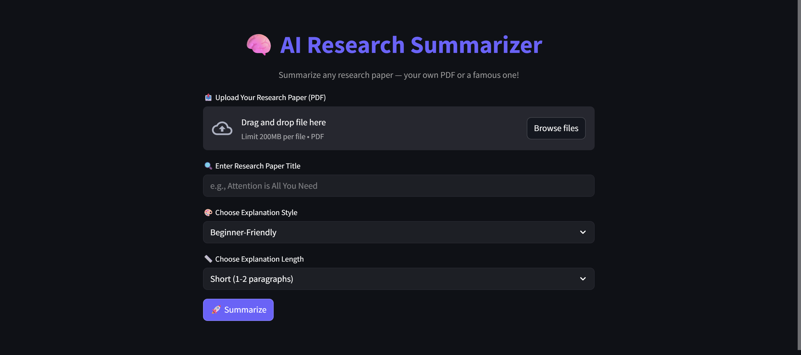
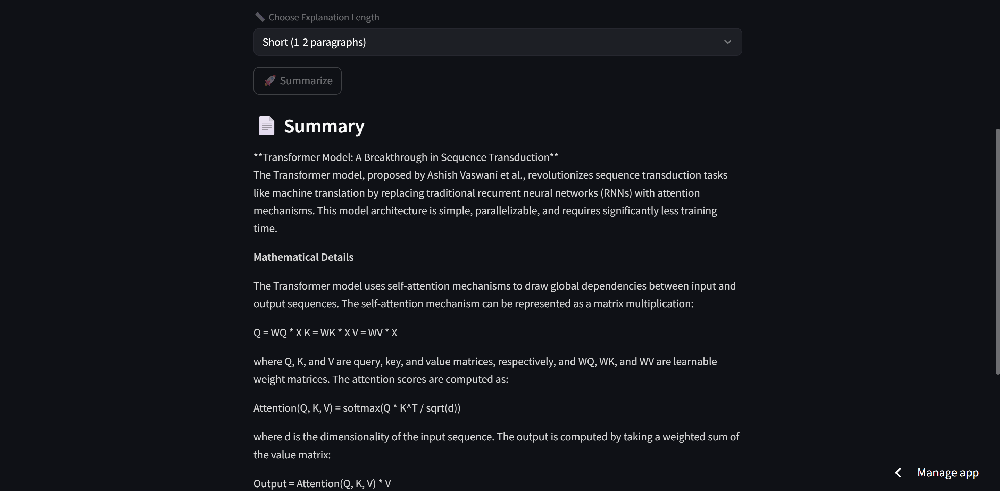

# 🚀 PaperWhiz – AI-Powered Research Paper Summarizer

**PaperWhiz** is a smart, stylish mini-project that helps users **summarize complex research papers** in different explanation styles and lengths using the power of **LLMs via Hugging Face**.  
Built with **LangChain**, **Streamlit**, and **LLaMA 3**, it provides a clean UI and even allows users to upload PDFs or search by paper title.

---

[Live Demo 🌐](https://paperwhiz-ai.streamlit.app/)

## 🌟 Features

- 🔍 Search for research papers by name or upload your own PDF
- 📄 PDF upload support with automatic content extraction
- 🎨 Choose explanation **style**: Beginner-Friendly, Technical, Code-Oriented, Mathematical
- 📏 Choose explanation **length**: Short, Medium, or Long
- ⚙️ Powered by **Meta’s LLaMA-3** via HuggingFace API
- 🌙 Dark-themed **modern UI** using Streamlit

---

## 📸 Screenshots

<p align="center">
  
  <br><br>
  
</p>

---

## 🧪 Tech Stack

- 🧠 **LLM Backend**: LangChain + HuggingFace
- 🧾 **PDF Parsing**: PyPDF2
- 🖥 **Frontend**: Streamlit (with a custom dark UI)
- 🔐 **Env Management**: Python + dotenv

---

## 🚀 Getting Started (Run Locally)

```bash
# 1️⃣ Clone the repo
git clone https://github.com/Hansha111/PaperWhiz.git
cd PaperWhiz

# 2️⃣ Create and activate virtual environment
python -m venv venv
# Windows
.\venv\Scripts\activate
# macOS/Linux
source venv/bin/activate

# 3️⃣ Install dependencies
pip install -r requirements.txt

# 4️⃣ Add your HuggingFace API key
# Create a .env file and add this line:
HUGGINGFACEHUB_API_TOKEN=your_token_here

# 5️⃣ Run the Streamlit app
streamlit run research_app.py
```

👩‍💻 Author Made with ❤️ by Hansha


📬 [Connect on LinkedIn](https://www.linkedin.com/in/hansha-rathod-34883a251/) &nbsp;&nbsp;&nbsp;🌟 [Star this repo](https://github.com/Hansha111/PaperWhiz) if you liked it!
